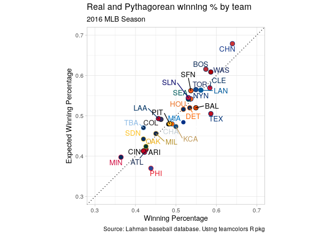
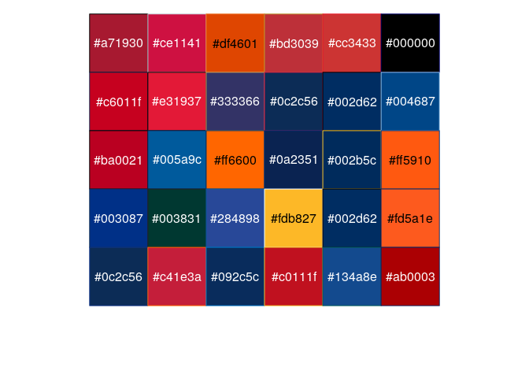

teamcolors
================

[](https://travis-ci.org/beanumber/teamcolors)

An R package providing color palettes for pro sports teams. The palettes
are provided by [Jim Neilsen’s Team Colors
website](http://jim-nielsen.com/teamcolors/) and offered with only
minimal alterations.

## Install

``` r
devtools::install_github("beanumber/teamcolors")
```

## Load

``` r
library(teamcolors)
head(teamcolors)
```

    ## # A tibble: 6 x 7
    ##   name                league primary secondary tertiary quaternary division
    ##   <chr>               <chr>  <chr>   <chr>     <chr>    <chr>      <chr>   
    ## 1 AFC Bournemouth     epl    #e62333 #000000   <NA>     <NA>       <NA>    
    ## 2 Anaheim Ducks       nhl    #010101 #a2aaad   #fc4c02  #85714d    Pacific 
    ## 3 Arizona Cardinals   nfl    #97233f #000000   #ffb612  #a5acaf    NFC West
    ## 4 Arizona Coyotes     nhl    #010101 #862633   #ddcba4  <NA>       <NA>    
    ## 5 Arizona Diamondbac… mlb    #a71930 #000000   #e3d4ad  <NA>       NL West 
    ## 6 Arsenal             epl    #ef0107 #023474   #9c824a  <NA>       <NA>

## Show palettes

Sometimes you need to work with a named vector of colors. Other times
you can use the built-in `scale_color_teams()` and `scale_color_fill()`
functions.

``` r
league_pal("mlb", 1)
```

    ##  Arizona Diamondbacks        Atlanta Braves     Baltimore Orioles 
    ##             "#a71930"             "#ce1141"             "#df4601" 
    ##        Boston Red Sox          Chicago Cubs     Chicago White Sox 
    ##             "#bd3039"             "#cc3433"             "#000000" 
    ##       Cincinnati Reds     Cleveland Indians      Colorado Rockies 
    ##             "#c6011f"             "#e31937"             "#333366" 
    ##        Detroit Tigers        Houston Astros    Kansas City Royals 
    ##             "#0c2c56"             "#002d62"             "#004687" 
    ##    Los Angeles Angels   Los Angeles Dodgers         Miami Marlins 
    ##             "#ba0021"             "#005a9c"             "#ff6600" 
    ##     Milwaukee Brewers       Minnesota Twins         New York Mets 
    ##             "#0a2351"             "#002b5c"             "#ff5910" 
    ##      New York Yankees     Oakland Athletics Philadelphia Phillies 
    ##             "#003087"             "#003831"             "#284898" 
    ##    Pittsburgh Pirates      San Diego Padres  San Francisco Giants 
    ##             "#fdb827"             "#002d62"             "#fd5a1e" 
    ##      Seattle Mariners   St. Louis Cardinals        Tampa Bay Rays 
    ##             "#0c2c56"             "#c41e3a"             "#092c5c" 
    ##         Texas Rangers     Toronto Blue Jays  Washington Nationals 
    ##             "#c0111f"             "#134a8e"             "#ab0003"

## Plot

In baseball, [Pythagorean
expectation](https://en.wikipedia.org/wiki/Pythagorean_expectation)
relates expected winning percentage to runs allowed and runs scored. How
well does it work?

``` r
library(Lahman)
library(tidyverse)
pythag <- Teams %>%
  filter(yearID == 2016) %>%
  select(name, teamID, yearID, W, L, R, RA) %>%
  mutate(wpct = W / (W + L), exp_wpct = 1 / (1 + (RA/R)^2),
         # note name discrepancy!
         name = ifelse(name == "Los Angeles Angels of Anaheim", "Los Angeles Angels", name))
```

### `ggplot2`

``` r
ggplot(pythag, aes(x = wpct, y = exp_wpct, color = name, fill = name)) + 
  geom_abline(slope = 1, intercept = 0, linetype = 3) + 
  geom_point(shape = 21, size = 3) + 
  scale_fill_teams(guide = FALSE) + 
  scale_color_teams(2, guide = FALSE) + 
  ggrepel::geom_text_repel(aes(label = teamID)) + 
  scale_x_continuous("Winning Percentage", limits = c(0.3, 0.7)) + 
  scale_y_continuous("Expected Winning Percentage", limits = c(0.3, 0.7)) + 
  theme_light() +
  labs(title = "Real and Pythagorean winning % by team",
       subtitle = paste(first(pull(pythag, yearID)), "MLB Season", sep = " "),
       caption = "Source: the Lahman baseball database. Using teamcolors R pkg") +
  coord_equal()
```

<!-- -->

### Base R

``` r
pythag <- pythag %>%
  left_join(teamcolors, by = "name")
with(pythag, plot(wpct, exp_wpct, bg = primary, col = secondary, pch = 21, cex = 3))
```

<!-- -->

## Key

You can see the color palettes using existing functionality from the
[scales](https://github.com/r-lib/scales) package, but it won’t show the
names of the teams.

``` r
scales::show_col(league_pal("mlb"), borders = league_pal("mlb", 2))
```

<!-- -->

So, instead, use `show_team_col()`.

``` r
show_team_col()
```

<!-- -->

## References

For more examples see:

  - Lopez, M.J., Matthews, G.J., Baumer, B.S., “How often does the best
    team win? A unified approach to understanding randomness in North
    American sport,” *The Annals of Applied Statistics*, vol. 12, no. 4,
    2018, pp. 2483–2516. URL
    (<https://projecteuclid.org/euclid.aoas/1542078053>)
